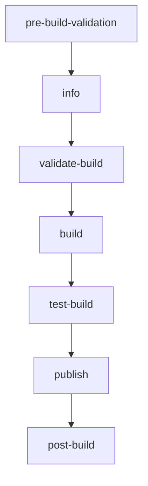

# AICleaner V3 Build System Guide

## Table of Contents
1. [Overview](#overview)
2. [Architecture](#architecture)
3. [Troubleshooting Guide](#troubleshooting-guide)
4. [Maintenance Procedures](#maintenance-procedures)
5. [Disaster Recovery](#disaster-recovery)
6. [Performance Optimization](#performance-optimization)
7. [Monitoring and Alerts](#monitoring-and-alerts)

## Overview

The AICleaner V3 build system is designed as a bulletproof, enterprise-grade CI/CD pipeline that uses multiple fallback strategies to ensure build reliability. The system automatically detects architectures, validates configurations, and builds Docker images for all supported Home Assistant architectures.

### Key Features
- **Multi-Strategy Fallback**: Never fails due to architecture detection issues
- **Comprehensive Validation**: Pre-build configuration and security checks
- **Enhanced Error Handling**: Automatic retry mechanisms and graceful degradation
- **Comprehensive Testing**: Multi-matrix testing with security scans
- **Build Monitoring**: Automated health checks and alerting
- **Detailed Reporting**: Complete build artifacts and status tracking

## Architecture

### Build Workflow Jobs



1. **pre-build-validation**: Validates config.yaml syntax and required fields
2. **info**: Multi-strategy architecture detection with fallbacks
3. **validate-build**: Enhanced security and configuration validation
4. **build**: Multi-architecture Docker builds with retry mechanisms
5. **test-build**: Comprehensive testing (startup, security, functionality)
6. **publish**: Artifact validation and registry publishing
7. **post-build**: Monitoring, cleanup, and comprehensive reporting

### Architecture Detection Strategies

The system uses a three-tier fallback approach:

1. **Strategy 1**: Home Assistant info action (`home-assistant/actions/helpers/info@master`)
2. **Strategy 2**: Direct config.yaml parsing with `yq`
3. **Strategy 3**: Hardcoded fallback with validation warnings

## Troubleshooting Guide

### Common Issues and Solutions

#### 1. Matrix Vector 'arch' Does Not Contain Any Values

**Symptoms:**
- Build fails at the matrix strategy level
- Error: "Matrix vector 'arch' does not contain any values"

**Root Causes:**
- Home Assistant info action failure
- Malformed config.yaml
- Missing architecture definitions

**Solution Steps:**
1. Check the `info` job logs for strategy used
2. Validate config.yaml syntax:
   ```bash
   cd aicleaner_v3
   yamllint config.yaml
   yq eval '.arch' config.yaml
   ```
3. If using hardcoded fallback, verify architectures match config.yaml
4. Check Home Assistant actions repository accessibility

#### 2. Pre-build Validation Failures

**Symptoms:**
- Build stops before reaching the build phase
- Configuration validation errors

**Diagnosis:**
```bash
# Check config.yaml structure
yq eval '.' aicleaner_v3/config.yaml

# Validate required fields
yq eval '.name, .version, .slug, .arch' aicleaner_v3/config.yaml

# Check Dockerfile
hadolint aicleaner_v3/Dockerfile
```

**Solutions:**
- Fix YAML syntax errors
- Add missing required fields
- Ensure architecture array is not empty
- Validate Dockerfile security practices

#### 3. Docker Build Failures

**Symptoms:**
- Build job fails during Docker build process
- Registry authentication errors
- Resource exhaustion

**Diagnosis Process:**
1. Check Docker environment setup logs
2. Verify registry connectivity
3. Review base image availability
4. Check disk space and resources

**Solutions:**
```bash
# Test base image availability
docker manifest inspect ghcr.io/home-assistant/amd64-base:3.19

# Check registry authentication
docker login ghcr.io

# Clean up Docker resources
docker system prune -af
```

#### 4. Architecture-Specific Build Issues

**Symptoms:**
- Some architectures build successfully, others fail
- Cross-compilation errors

**Investigation Steps:**
1. Review build artifacts for each architecture
2. Check base image availability for specific architectures
3. Examine build logs for architecture-specific errors

**Solutions:**
- Update base image versions in build.yaml
- Adjust Dockerfile for cross-compilation compatibility
- Verify architecture-specific dependencies

#### 5. Test Failures

**Symptoms:**
- Build succeeds but tests fail
- Security scan failures
- Container startup issues

**Debug Process:**
```bash
# Test container locally
cd aicleaner_v3
docker build -t test-local .
docker run --rm test-local /bin/sh

# Run security scan
trivy image test-local

# Check startup logs
docker run test-local
```

#### 6. Publishing Failures

**Symptoms:**
- Build and test pass but publishing fails
- Registry push errors
- Artifact validation failures

**Resolution:**
1. Verify all architecture builds completed
2. Check GitHub Container Registry permissions
3. Validate Docker manifest creation
4. Review registry quotas and limits

### Emergency Recovery Procedures

#### Complete Build System Failure

1. **Immediate Response:**
   ```bash
   # Check system status
   ./.github/scripts/build-status-monitor.sh
   
   # Run health check
   gh workflow run build-health-monitor.yml
   ```

2. **Rollback to Known Good State:**
   ```bash
   # Revert to last working commit
   git log --oneline -10
   git revert <commit-hash>
   ```

3. **Manual Build Process:**
   ```bash
   # Emergency manual build
   cd aicleaner_v3
   docker buildx build --platform linux/amd64,linux/arm64 \
     -t ghcr.io/sporebattyl/aicleaner_v3:emergency \
     --push .
   ```

#### Configuration Corruption

1. **Backup Recovery:**
   ```bash
   # Restore from backup
   cp aicleaner_v3/config.yaml.backup aicleaner_v3/config.yaml
   ```

2. **Regenerate Configuration:**
   ```bash
   # Validate and fix config
   yamllint aicleaner_v3/config.yaml
   yq eval '.arch = ["aarch64","amd64","armhf","armv7"]' -i aicleaner_v3/config.yaml
   ```

## Maintenance Procedures

### Daily Maintenance

1. **Monitor Build Health:**
   ```bash
   ./.github/scripts/build-status-monitor.sh -l 10
   ```

2. **Check Resource Usage:**
   - Review GitHub Actions minutes usage
   - Monitor Docker registry storage
   - Check artifact retention

### Weekly Maintenance

1. **Security Updates:**
   ```bash
   # Update base images in build.yaml
   # Check for Home Assistant base image updates
   docker manifest inspect ghcr.io/home-assistant/amd64-base:latest
   ```

2. **Performance Review:**
   - Analyze build duration trends
   - Review cache hit rates
   - Optimize slow build steps

### Monthly Maintenance

1. **Dependency Updates:**
   - Update GitHub Actions versions
   - Review and update tool versions (yq, jq, hadolint)
   - Test compatibility with new Home Assistant versions

2. **Configuration Audit:**
   - Review and update architecture support
   - Validate security configurations
   - Update documentation

### Quarterly Maintenance

1. **Complete System Review:**
   - End-to-end build testing
   - Disaster recovery testing
   - Performance optimization review

2. **Documentation Updates:**
   - Update troubleshooting procedures
   - Review and update runbooks
   - Update monitoring configurations

## Disaster Recovery

### Backup Strategy

1. **Configuration Backups:**
   ```bash
   # Automated daily backups
   cp aicleaner_v3/config.yaml "backups/config-$(date +%Y%m%d).yaml"
   cp .github/workflows/build.yml "backups/build-$(date +%Y%m%d).yml"
   ```

2. **Registry Backups:**
   - Mirror critical images to backup registry
   - Maintain image manifests and tags
   - Document recovery procedures

### Recovery Procedures

#### Scenario 1: Workflow File Corruption

1. **Detection:**
   - Build health monitor alerts
   - Workflow syntax errors
   - Complete build failures

2. **Recovery:**
   ```bash
   # Restore from backup
   cp "backups/build-$(date +%Y%m%d).yml" .github/workflows/build.yml
   
   # Validate restoration
   yamllint .github/workflows/build.yml
   
   # Test build
   gh workflow run build.yml
   ```

#### Scenario 2: Registry Unavailability

1. **Immediate Actions:**
   - Switch to backup registry
   - Update workflow registry configuration
   - Notify users of temporary changes

2. **Long-term Recovery:**
   - Restore primary registry
   - Sync images from backup
   - Update DNS/routing as needed

#### Scenario 3: Complete GitHub Actions Failure

1. **Alternative Build Platforms:**
   ```bash
   # Set up GitLab CI backup
   # Configure Jenkins pipeline
   # Implement local build infrastructure
   ```

2. **Manual Build Process:**
   ```bash
   # Emergency build script
   ./scripts/emergency-build.sh
   ```

## Performance Optimization

### Build Speed Optimization

1. **Docker Layer Caching:**
   - Optimize Dockerfile layer order
   - Use BuildKit cache mounts
   - Implement multi-stage builds

2. **Parallel Processing:**
   - Matrix builds run in parallel
   - Optimize job dependencies
   - Use GitHub's matrix.max-parallel

3. **Resource Management:**
   ```yaml
   # Optimize runner resources
   runs-on: ubuntu-latest-8-cores  # For heavy builds
   ```

### Cache Optimization

1. **Docker Cache:**
   ```yaml
   # Optimized cache configuration
   - name: Setup Docker layer caching
     uses: actions/cache@v4
     with:
       path: /tmp/.buildx-cache
       key: ${{ runner.os }}-buildx-${{ matrix.arch }}-${{ github.sha }}
       restore-keys: |
         ${{ runner.os }}-buildx-${{ matrix.arch }}-
   ```

2. **Dependency Caching:**
   ```yaml
   # Cache package installations
   - name: Cache apt packages
     uses: actions/cache@v4
     with:
       path: /var/cache/apt
       key: apt-${{ runner.os }}-${{ hashFiles('**/packages.txt') }}
   ```

## Monitoring and Alerts

### Health Check Configuration

1. **Automated Monitoring:**
   - Daily health checks via GitHub Actions
   - Continuous monitoring script
   - Integration with monitoring services

2. **Alert Thresholds:**
   ```bash
   # Configure alert thresholds
   SUCCESS_RATE_THRESHOLD=90
   CONSECUTIVE_FAILURE_THRESHOLD=3
   BUILD_DURATION_THRESHOLD=30  # minutes
   ```

### Notification Channels

1. **GitHub Issues:**
   - Automatic issue creation for critical failures
   - Structured issue templates
   - Automatic labeling and assignment

2. **External Integrations:**
   ```bash
   # Slack webhook integration
   curl -X POST -H 'Content-type: application/json' \
     --data '{"text":"Build health alert: ..."}' \
     $SLACK_WEBHOOK_URL
   ```

### Metrics and Dashboards

1. **Key Metrics:**
   - Build success rate
   - Average build duration
   - Architecture-specific failure rates
   - Resource utilization

2. **Dashboard Components:**
   - Real-time build status
   - Historical trends
   - Performance metrics
   - Alert summary

## Best Practices

### Development Workflow

1. **Testing Changes:**
   ```bash
   # Test workflow changes in fork
   # Use workflow_dispatch for manual testing
   # Validate with limited matrix first
   ```

2. **Gradual Rollout:**
   - Test with single architecture first
   - Gradually expand to all architectures
   - Monitor closely during changes

### Security Considerations

1. **Secret Management:**
   - Use GitHub Secrets for sensitive data
   - Rotate tokens regularly
   - Audit secret access

2. **Image Security:**
   - Regular vulnerability scans
   - Minimize base image attack surface
   - Keep dependencies updated

### Documentation Standards

1. **Change Documentation:**
   - Document all significant changes
   - Update runbooks after modifications
   - Maintain architecture decision records

2. **Knowledge Sharing:**
   - Regular team training on build system
   - Incident post-mortems
   - Continuous improvement process

---

**Last Updated:** $(date -u +%Y-%m-%d)
**Version:** 1.0
**Maintainer:** AICleaner V3 Build Team