# CI/CD Pipeline Documentation

## Overview

This document provides a comprehensive overview of the CI/CD pipeline for the AICleaner V3 Home Assistant addon. The pipeline is designed to ensure code quality, security, and reliable automated deployments.

## Pipeline Architecture

### 🏗️ Workflow Structure



```mermaid
graph TD
    A[Code Push/PR] --> B[CI Workflow]
    A --> C[Security Scan]
    A --> D[Build Workflow]
    
    B --> E[Lint & Quality]
    B --> F[Validate Config]
    B --> G[Test Matrix]
    B --> H[Integration Tests]
    B --> I[Performance Tests]
    
    C --> J[CodeQL Analysis]
    C --> K[Trivy FS Scan]
    C --> L[Container Scan]
    C --> M[Dependency Check]
    
    D --> N[Multi-arch Build]
    D --> O[Test Images]
    D --> P[Publish Images]
    
    Q[Tag Release] --> R[Release Workflow]
    R --> S[Validate Release]
    R --> T[Generate Notes]
    R --> U[Security Scan]
    R --> V[Publish Release]
    
    W[Schedule] --> X[Maintenance]
    X --> Y[Dependency Updates]
    X --> Z[Security Audit]
    X --> AA[Performance Monitor]
    X --> BB[Cleanup]
```

## Workflow Details

### 1. CI Workflow (`ci.yml`)

**Triggers:**
- Push to `main` branch
- Pull requests to `main`

**Jobs:**

#### Lint & Quality Check
- **Ruff linting**: Fast Python linter for code quality
- **Black formatting**: Code formatting validation
- **isort imports**: Import sorting validation
- **MyPy type checking**: Static type analysis

#### Configuration Validation
- **Docker configuration**: Validates Dockerfiles and build setup
- **Home Assistant config**: Validates addon configuration schema
- **Python syntax**: Validates all Python files compile correctly

#### Testing Matrix
- **Python versions**: 3.9, 3.10, 3.11, 3.12
- **Core functionality**: Custom test runner execution
- **pytest coverage**: Comprehensive test coverage with reports

#### Integration Testing
- **MQTT connectivity**: Tests with live MQTT broker
- **Service integration**: Validates Home Assistant integration
- **Smoke tests**: Basic functionality validation

#### Performance Testing
- **Startup benchmarks**: Measures addon initialization time
- **Memory profiling**: Monitors memory usage patterns
- **Performance thresholds**: Validates against defined limits

### 2. Security Workflow (`security.yml`)

**Triggers:**
- Push to `main`/`develop` branches
- Pull requests to `main`
- Weekly scheduled scan (Mondays 5:30 AM UTC)

**Jobs:**

#### CodeQL Analysis
- **SAST scanning**: Static Application Security Testing
- **Enhanced queries**: Security and quality rule pack
- **Language support**: Python analysis
- **SARIF upload**: Results to GitHub Security tab

#### Trivy Scanning
- **Filesystem scan**: Repository vulnerability scanning
- **Container scanning**: Multi-architecture image analysis
- **Severity levels**: Critical, High, Medium vulnerabilities
- **SARIF integration**: Centralized security reporting

#### Dependency Security
- **Safety check**: Known vulnerability database scanning
- **Bandit analysis**: Python security linting
- **Report artifacts**: Detailed security findings

### 3. Build Workflow (`build.yml`)

**Triggers:**
- Push to `main` branch
- Pull requests to `main`
- Git tags (`v*`)
- Release events

**Jobs:**

#### Build Information
- **Architecture detection**: Auto-detects supported platforms
- **Metadata extraction**: Version, name, slug information
- **Build validation**: Pre-build configuration checks

#### Multi-Architecture Build
- **Supported platforms**: amd64, arm64, armv7, armhf, i386
- **Docker Buildx**: Advanced multi-platform builds
- **Layer caching**: Optimized build performance
- **Registry publishing**: GitHub Container Registry

#### Build Testing
- **Image validation**: Container functionality testing
- **Security scanning**: Built image vulnerability analysis
- **Startup testing**: Container initialization validation

#### Publishing
- **Conditional publishing**: Only on releases or main branch
- **Artifact generation**: Release packages and checksums
- **GitHub releases**: Automated release creation

### 4. Release Workflow (`release.yml`)

**Triggers:**
- Git tags (`v*`)
- Release creation/publication

**Jobs:**

#### Release Validation
- **Version format**: Semantic versioning validation
- **Config consistency**: Ensures version matches across files
- **Prerelease detection**: Identifies alpha/beta/rc versions

#### Release Notes Generation
- **Automated changelog**: Git commit analysis
- **Version information**: Build metadata inclusion
- **Installation instructions**: User-friendly setup guide

#### Security Validation
- **Pre-release scan**: Comprehensive security audit
- **Critical vulnerability check**: Blocks unsafe releases

#### Documentation Updates
- **README updates**: Version badge and instruction updates
- **Automated commits**: Documentation synchronization

#### GitHub Release
- **Asset generation**: Release packages and checksums
- **Release notes**: Automated description generation
- **Notification system**: Release completion summaries

### 5. Maintenance Workflow (`maintenance.yml`)

**Triggers:**
- Weekly schedule (Mondays 2 AM UTC)
- Daily monitoring (2 PM UTC)
- Manual dispatch with task selection

**Jobs:**

#### Dependency Management
- **Update detection**: pip-tools dependency checking
- **Automated PRs**: Dependency update pull requests
- **Compatibility validation**: Breaking change detection

#### Security Auditing
- **Safety scanning**: Vulnerability database checks
- **Bandit analysis**: Security code analysis
- **Semgrep analysis**: Advanced static analysis
- **Report generation**: Comprehensive security findings

#### Performance Monitoring
- **Baseline metrics**: Performance threshold validation
- **Resource usage**: Memory and CPU monitoring
- **Image size tracking**: Container size optimization

#### Repository Cleanup
- **Cache cleaning**: Temporary file removal
- **Health checks**: Repository integrity validation
- **Large file detection**: Storage optimization

## Performance Optimizations

### 🚀 Caching Strategy

#### Dependency Caching
```yaml
- name: Cache pip dependencies
  uses: actions/cache@v3
  with:
    path: ~/.cache/pip
    key: ${{ runner.os }}-pip-${{ hashFiles('**/requirements.txt') }}
```

#### Docker Layer Caching
```yaml
- name: Cache Docker layers
  uses: actions/cache@v3
  with:
    path: /tmp/.buildx-cache
    key: ${{ runner.os }}-buildx-${{ matrix.arch }}-${{ github.sha }}
```

### 📊 Build Metrics

- **Average CI time**: 2-3 minutes
- **Build time**: 30-60 seconds per architecture
- **Security scan**: 1-2 minutes
- **Cache hit rate**: 80-90% for dependencies

## Security Features

### 🛡️ Multi-Layer Security

1. **Static Analysis**: CodeQL, Bandit, Semgrep
2. **Dependency Scanning**: Safety, Trivy
3. **Container Security**: Image vulnerability scanning
4. **Runtime Security**: Non-privileged execution
5. **Supply Chain**: SARIF reporting, artifact attestation

### 🔒 Security Policies

- **Critical vulnerabilities**: Block releases
- **High severity issues**: Require manual review
- **Medium severity**: Monitor and track
- **Weekly audits**: Automated security scanning

## Monitoring & Alerts

### 📈 Health Metrics

- **Build success rate**: > 95%
- **Security scan coverage**: 100%
- **Performance thresholds**: Defined and monitored
- **Dependency freshness**: Weekly updates

### 🚨 Alert Conditions

- **Security vulnerabilities**: Critical/High severity
- **Build failures**: Consecutive failures
- **Performance degradation**: Threshold violations
- **Dependency issues**: Known vulnerabilities

## Usage Guidelines

### 🔄 Development Workflow

1. **Feature Development**:
   ```bash
   git checkout -b feature/new-feature
   # Develop feature
   git push origin feature/new-feature
   # Create PR - triggers CI/Security workflows
   ```

2. **Release Process**:
   ```bash
   # Update version in config.yaml
   git tag v1.2.3
   git push origin v1.2.3
   # Triggers Release workflow
   ```

3. **Hotfix Process**:
   ```bash
   git checkout -b hotfix/urgent-fix
   # Apply fix
   git tag v1.2.4
   git push origin v1.2.4
   ```

### 🎯 Best Practices

1. **Commit Messages**: Use conventional commit format
2. **Version Management**: Follow semantic versioning
3. **Security**: Regular dependency updates
4. **Testing**: Comprehensive test coverage
5. **Documentation**: Keep pipeline docs updated

## Troubleshooting

### 🔧 Common Issues

#### Build Failures
```bash
# Check Docker configuration
docker build -t test ./aicleaner_v3

# Validate requirements
pip install -r aicleaner_v3/requirements.txt
```

#### Security Scan Failures
```bash
# Local security check
pip install safety bandit
safety check
bandit -r aicleaner_v3/
```

#### Test Failures
```bash
# Run tests locally
cd aicleaner_v3
python -m pytest tests/ -v
```

### 📞 Support

- **GitHub Issues**: Repository issue tracker
- **Workflow Logs**: GitHub Actions logs
- **Security Alerts**: GitHub Security tab
- **Performance Metrics**: Workflow summaries

## Future Enhancements

### 🚀 Planned Improvements

1. **Enhanced Testing**:
   - End-to-end testing with Home Assistant
   - Load testing for high-volume scenarios
   - Browser testing for web interface

2. **Advanced Security**:
   - SLSA provenance generation
   - Signed container images
   - Runtime security monitoring

3. **Performance Optimization**:
   - Build parallelization
   - Incremental testing
   - Smart test selection

4. **Deployment Automation**:
   - Staging environment deployment
   - Canary releases
   - Rollback automation

## Configuration Reference

### 📋 Required Secrets

- `GITHUB_TOKEN`: Automatic (GitHub-provided)

### 🔧 Optional Configuration

```yaml
# .github/dependabot.yml
version: 2
updates:
  - package-ecosystem: "pip"
    directory: "/aicleaner_v3"
    schedule:
      interval: "weekly"
```

### 📊 Workflow Customization

```yaml
# Customize security scanning
env:
  TRIVY_SEVERITY: "CRITICAL,HIGH,MEDIUM,LOW"
  CODEQL_QUERIES: "security-and-quality"
```

---

*This documentation is automatically maintained as part of the CI/CD pipeline. Last updated: $(date)*